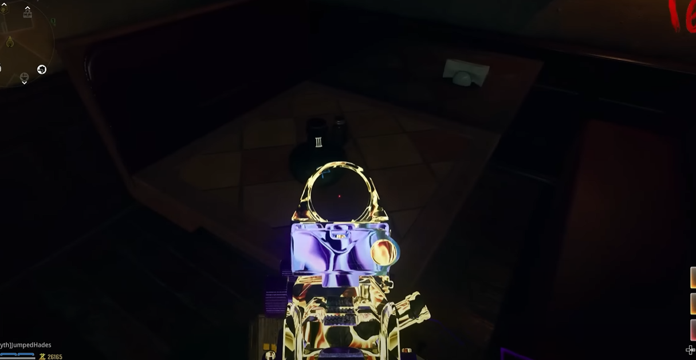

# Citadelle Des Morts Main Quest Guide

## Recommended setup:

## Note:
* Must upgrade all swords
* Must have all incantations

## Steps

### Step 1:
Activate pack-a-punch.

### Step 2:
Interact with a wooden door in the dungeon.\
\

### Step 3:
Using Melee Macchiato, punch this wall in the undercroft:\
\
\
\
Go to the tavern. There are six numbered bottles in the tavern. Interact with all six to reveal a symbol on each bottle. Shoot the symbols on the wall in the given order to input them.

#### Bottle locations:
On the bar.\
\
\
On this table:\
\
\
On this booth in the corner:\
\
\
Upstairs on a shelf.\
\
\
On this booth:\
\
\
On this table in the corner by the entrance:\

### Step 4:
Pick up four pages in the sitting rooms. These pages will be put into the book on the wall that was just opened up by interacting with it.

#### First page locations:
On the wall in the corner.\
\
\
On the wall to the left.\
\
\
On the parallel wall.\

#### Second page locations:
On this stack of TVs:\
\
\
Sitting on the sofa.\
\
\
Next to the TV.\

#### Third page locations;
On the mattress to the left of the fireplace.\
\
\
On the side table of the bunks.\
\
\
In front of the radio on the table.\

#### Fourth page locations:
Next to the rope.\
\
\
On these boxes:\
\
\
At the base of the boxes.\

### Step 5:
The positioning of the pages on the book determines the order in which this step will be completed:\
\
\
\
Find the traps around the map that have the matching symbols. Activate the trap and kill zombies until the trap turns itself off. The symbol in the book should also be dim. Do this for all four symbols, making sure to do it in the correct order in which the symbols are positioned.

### Step 6:
At this point, you will need to have all swords upgraded and all incantations. On the undercroft stairway, this wall will show symbols for each statue in a random order:\
\
\
\
You will hit the first statue with its associated incantation and then weapon inspect with the same sword directly in front of the statue. If the dragon is the first symbol (top symbol), hit the dragon statue with the fire incantation and then inspect the dragon sword. The statue will then glow yellow and that statue is done. Do this for all four statues in the order on the wall. Once all four are done an orb will fall into the center of the room, pick it up. Complete the trials for all four swords, it can be done in any order. Make sure the player completing a trial has the associated sword for the trial.

#### Dragon:
Put the orb into this holder in the courtyard:\
\
\
\
Interact with the orb, it will change color. Get fire kills near the orb. This can be done in any way that involves a zombie burning to death, this trial may be timed. Once enough zombies have been killed pick up the orb.

#### Lion:
Put the orb into the orb holder in the dining hall.\
\
\
\
Interact to begin the trial. Big green orbs will spawn in, run into those orbs until enough have been completed. Pick up the orb.

#### Raven:
Put the orb into the holding in the undercroft.\
\
\
\
Interact with it to begin. Get kills that specifically suck up zombies and drop them from the air. Once enough have been killed pick up the orb.

#### Stag:
Put the orb to the holder in the town square and then interact with it.\
\
\
\
Get electrical kills until the orb is charged, and pick up the orb.

### Step 7:
Get all set up for the boss fight. At the wall in the undercroft stairway, interact with it. Interact with the guardian key, and pick it up. Place the key at the base of the statue in the town square.

### Step 8:
The boss will be completely armored. Shoot at focused spots in the boss to eventually break open the armor to then shoot weak points under the armor. The weak points will go away forcing you to blow open other parts of the boss' armor. There are phases where it cannot be damaged and you must survive. When that is done the arena will shrink and you can damage the boss again. This process will be repeated, shrinking the arena until the boss is killed.

### Step 9:
bon jeu
