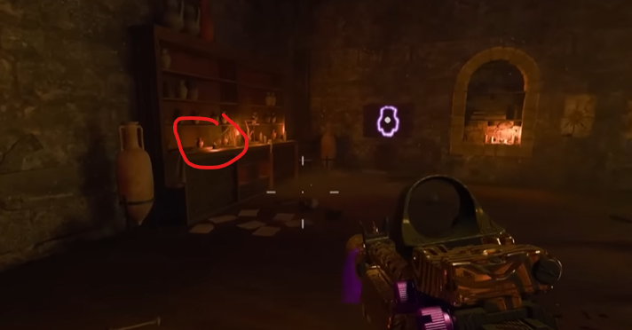

# Raven Sword Guide

## Note:
* Need a stamp to pick up raven sword from the statue

## Steps

### Step 1:
Pick up one of five parts in the alchemical lab.

#### Locations:
Raven skull and lion's jaw:\
\
\
Fish fossil:\
\
\
Scorpion fossil:\
\
\
Ram horn:\

### Step 2:
In the basement of the tavern there is a wheel on the wall, interact with it. Interact with it to place the sword into the wheel as well. Interact with the wheel to rotate it, depending on the fossil used in the wheel, rotate the code accordingly.\
\
\
\
A portal will open in the ground in the room, purple orbs will start comming out of the wall wheel. The purple orbs will chase you, if you draw them above the portal in the ground they will be sucked into it. Do this until the portal moves, you will be able to follow it. Keep repeating this until all three portals have been done. Follow the portal back to the wheel, interact with it and the raven sword will come out.
